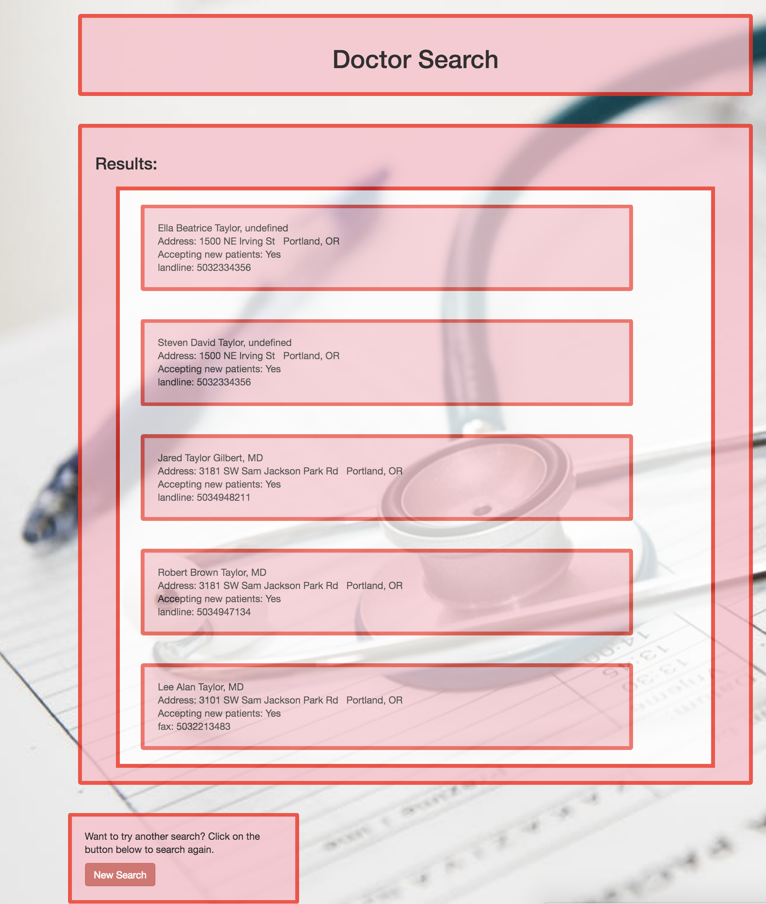

# _doctorSearch_

#### _doctorSearch, September 15, 2017_

#### By _**Paul Guevarra**_

## Description

_Achoo! As we all know, everybody needs to see a doctor sometimes. But finding a doctor that provides the services you need nearby can be time consuming. To facilitate this, this website is where users may enter a medical issue (ig: “sore throat”, "rash", etc.) into a form, submit it, and receive a list of doctors in your city who can treat their medical issue.._

## Setup/Installation Requirements

* _Access doctorserch repository at "https://github.com/paulguevarra/doctorserch.git"_
* _Clone repository into computer_
* _Obtain API Key at "https://developer.betterdoctor.com/ "_
* _Create .env file_
* _Enter inside env file: exports.apiKey = "your API Key"_
* _"npm install" in terminal command line_
* _"bower install" in terminal command line_
* _"gulp build" in terminal command line_
* _"gulp serve" in terminal command line_
* _Browse through content_

##Specs "it can..."

| Description                                        | Input                                       | Output              |
| -------------------------------------------------- | -------------------------------------------:| ------------------: |
| return list of doctors by name  | Johnson | list all doctors with name Johnson |
| retrieve all information about each doctor | Dr Johnson | first name, last name, address, phone #, if accepting new patients |
| notify if an error has occurred | error  | there was an error  |
| notify if search query returned empty |  Dr Zaius  | none found |

## Known bugs
_methods to retrieve further details such as acceptance of new patients and phone number have not yet been created_

## Support and contact details

_For further issues or questions, please contact: Paul Guevarra email: p.a.guevarra@gmail.com_

## Technologies Used

* _JavaScript_
* _Karma_
* _JSON_
* _Jasmine_
* _Node.js_
* _Bower_

### License

*This Software is licensed under the MIT License*

Copyright (c) 2017 **_Paul Guevarra_**
